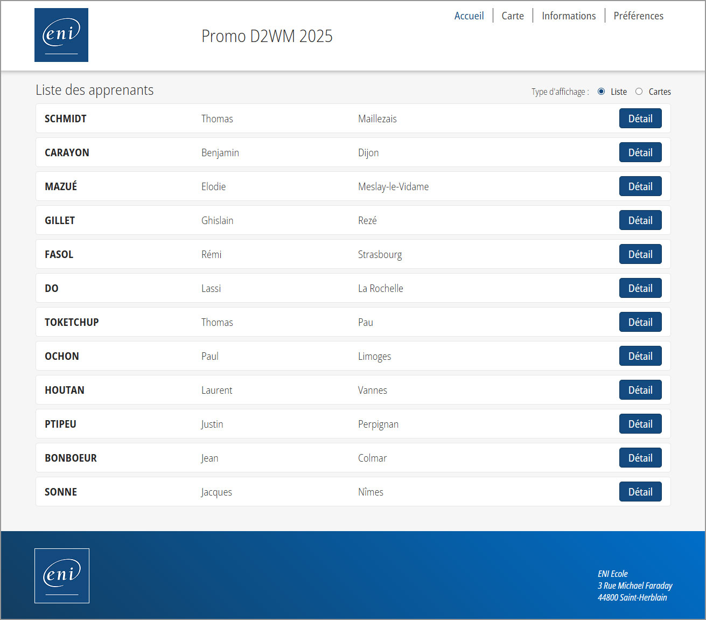
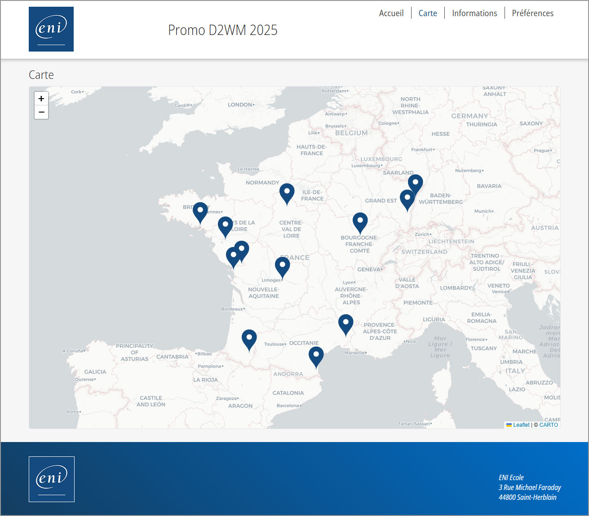
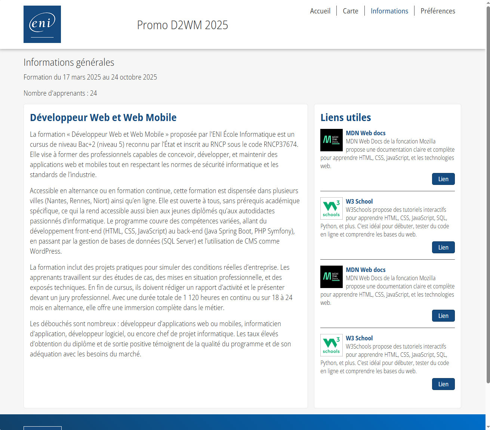
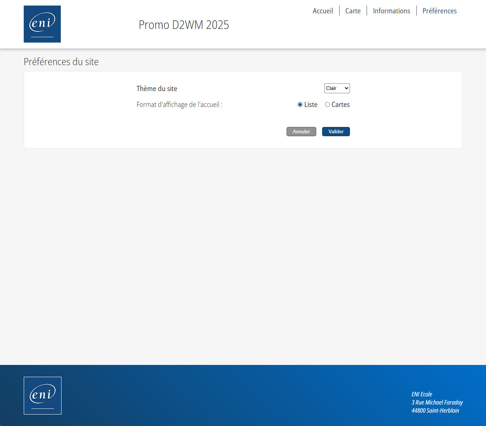
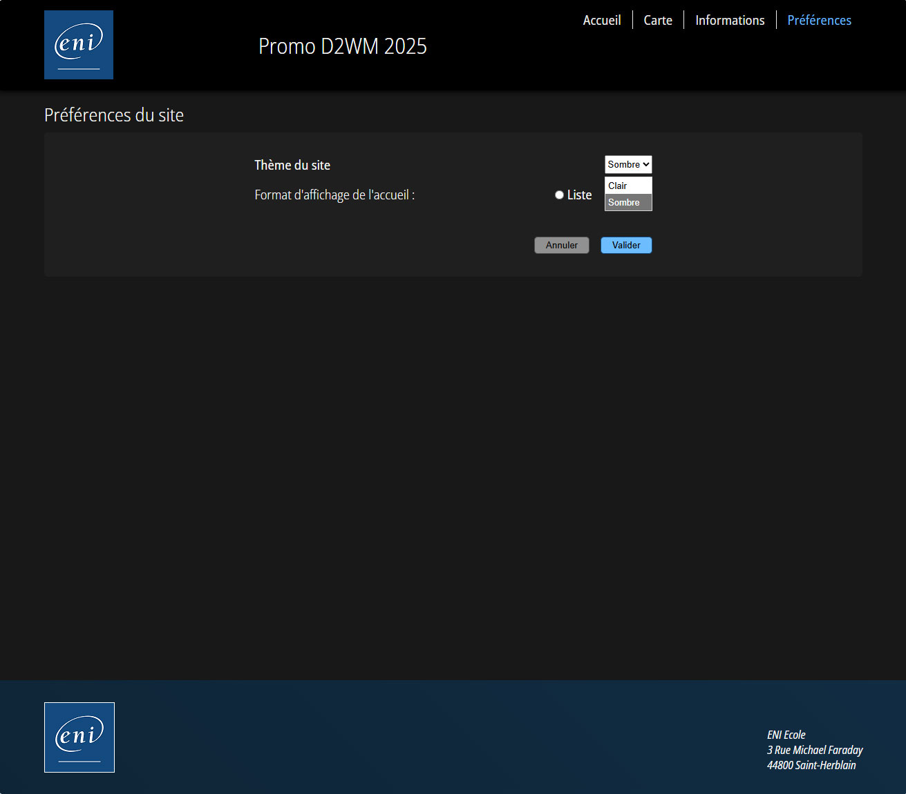
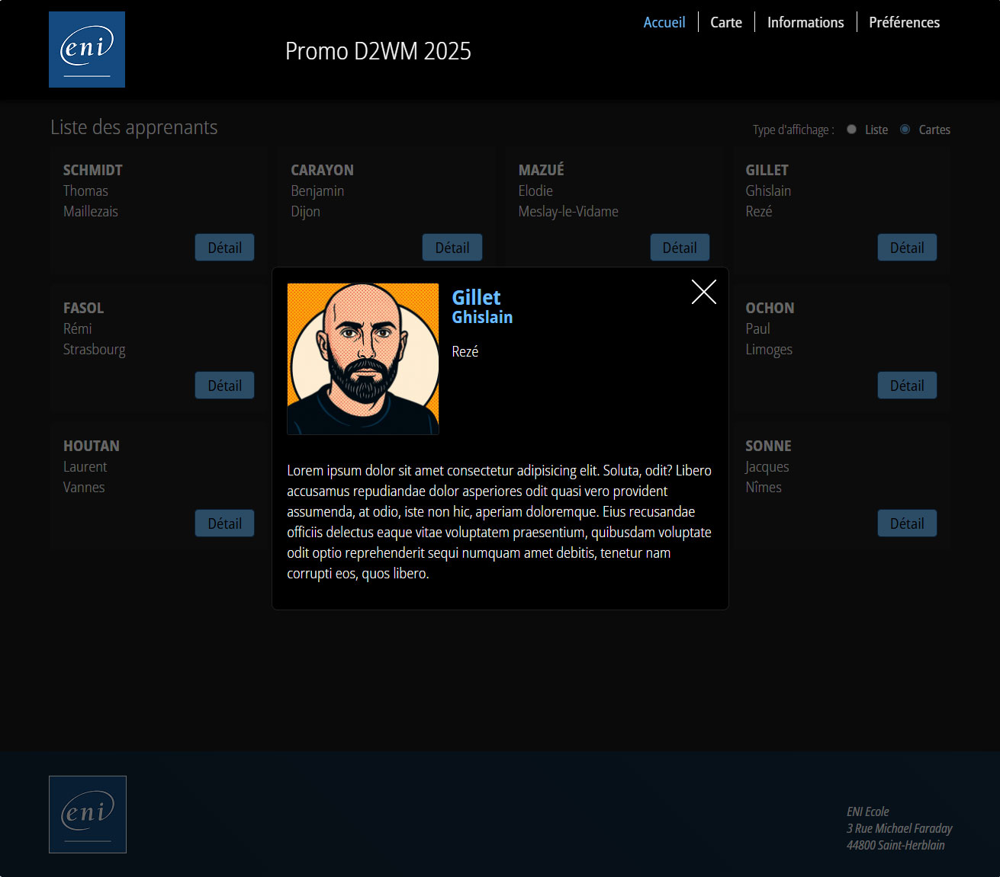
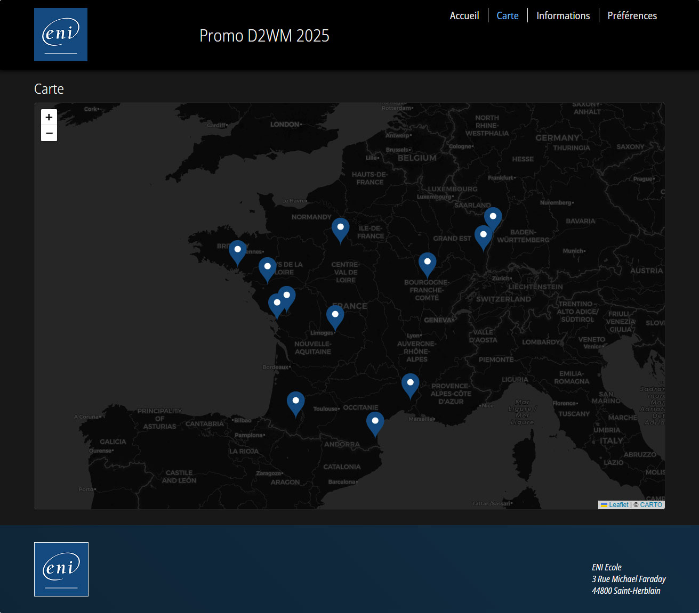
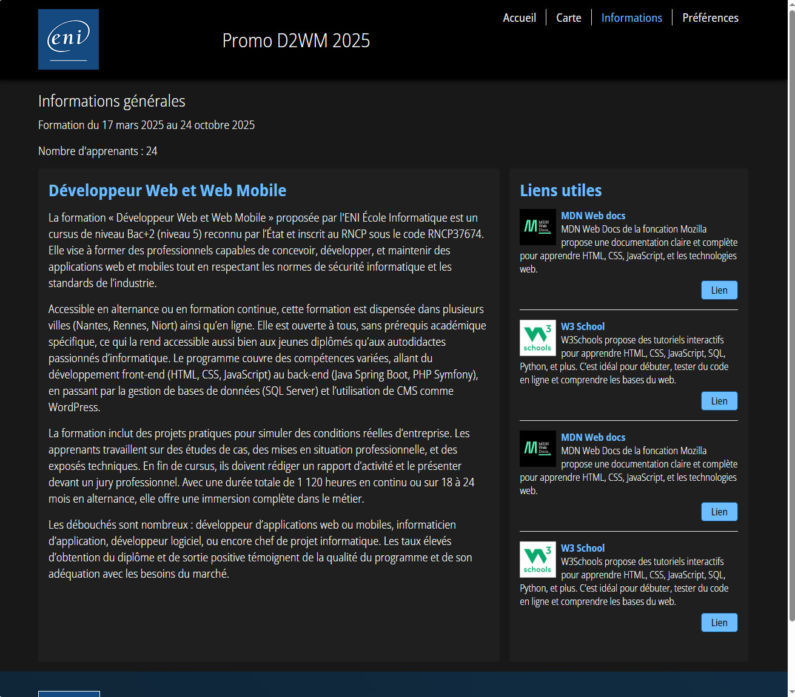

## 📘 Projet ENI 01 - Front - Présentation de la promotion

### 🚀 Technologies utilisées
- HTML
- CSS
- JavaScript

### 📝 Description

Il s'agit du **premier projet réalisé en autonomie** après seulement 1 mois de formation à l'ENI.

L'objectif était de concevoir un mini-site vitrine présentant les **stagiaires de notre promotion** avec plusieurs fonctionnalités clés :

- Chargement dynamique des données des apprenants depuis un fichier **JSON**
- Affichage d’une **carte interactive** localisant les membres de la promo
- Une page "Informations"
- Une page "Préférences" permettant :
  - Le **choix de la mise en page** de la page d’accueil
  - Le **changement de thème clair/sombre** (via `localStorage`)

### 🔍 Aperçu
#### 🏠 Page d'accueil

#### 🗺️ Carte des stagiaires

#### ℹ️ Page d'infos

#### ℹ️ Page de préfèrences

#### ℹ️ Page de préfèrences en mode sombre

#### ℹ️ Page d'accueil en mode sombre, affichage cards + popin détails

#### 🗺️ Carte des stagiaires en mode sombre

#### ℹ️ Page d'infos en mode sombre

### 👨‍💻 Auteur
Ghislain Gillet – Développeur Full Stack en reconversion  
[LinkedIn](https://www.linkedin.com/in/ghislain-gillet44)  
